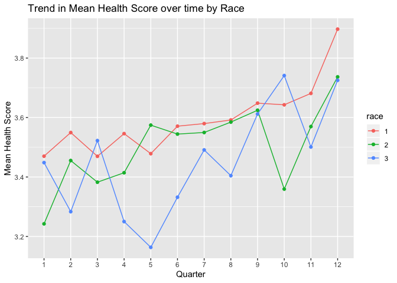

practice\_exercise
================
Ekta Chaudhary
28/06/2020

``` r
library(tidyverse)
```

    ## ── Attaching packages ──────────────────────────────────────────────────────────────── tidyverse 1.2.1 ──

    ## ✔ ggplot2 3.2.1     ✔ purrr   0.3.2
    ## ✔ tibble  2.1.3     ✔ dplyr   0.8.3
    ## ✔ tidyr   1.0.0     ✔ stringr 1.4.0
    ## ✔ readr   1.3.1     ✔ forcats 0.4.0

    ## ── Conflicts ─────────────────────────────────────────────────────────────────── tidyverse_conflicts() ──
    ## ✖ dplyr::filter() masks stats::filter()
    ## ✖ dplyr::lag()    masks stats::lag()

``` r
library(readxl)
library(dplyr)
library(sqldf)
```

    ## Loading required package: gsubfn

    ## Loading required package: proto

    ## Loading required package: RSQLite

``` r
library(ggthemes)
```

``` r
practice_data = read_excel("./data/Practice_exercise.xlsx", sheet = "Data") %>%
  janitor::clean_names() %>%
  select(observation_number,quarter,employee_id, sex = sex_male_1, race, age, hospital_visit = hospital_visit_this_quarter_1_yes, salary, health_score) %>%
  mutate(
    age_cat = case_when(
      age < 30 ~ 1,
      age <= 45 ~ 2,
      age > 45 ~ 3
    )
  )
```

\#Checking for missing data

``` r
sapply(practice_data, function(x) sum(is.na(x)))
```

    ## observation_number            quarter        employee_id 
    ##                  0                  0                  0 
    ##                sex               race                age 
    ##                 71               2123                  0 
    ##     hospital_visit             salary       health_score 
    ##                  0                  0                  0 
    ##            age_cat 
    ##                  0

\#Checking for missing data

``` r
practice_data %>%
  select(everything()) %>%  # replace to your needs
  summarise_all(funs(sum(is.na(.))))
```

    ## Warning: funs() is soft deprecated as of dplyr 0.8.0
    ## Please use a list of either functions or lambdas: 
    ## 
    ##   # Simple named list: 
    ##   list(mean = mean, median = median)
    ## 
    ##   # Auto named with `tibble::lst()`: 
    ##   tibble::lst(mean, median)
    ## 
    ##   # Using lambdas
    ##   list(~ mean(., trim = .2), ~ median(., na.rm = TRUE))
    ## This warning is displayed once per session.

    ## # A tibble: 1 x 10
    ##   observation_num… quarter employee_id   sex  race   age hospital_visit
    ##              <int>   <int>       <int> <int> <int> <int>          <int>
    ## 1                0       0           0    71  2123     0              0
    ## # … with 3 more variables: salary <int>, health_score <int>, age_cat <int>

\#finding the minimum and maximum values of each variable

``` r
sapply(practice_data, function(x) min(x)) 
```

    ## observation_number            quarter        employee_id 
    ##       1.000000e+00       1.000000e+00       1.000000e+00 
    ##                sex               race                age 
    ##                 NA                 NA       7.000000e+00 
    ##     hospital_visit             salary       health_score 
    ##       0.000000e+00       2.835070e+04       6.265991e-01 
    ##            age_cat 
    ##       1.000000e+00

``` r
sapply(practice_data, function(x) max(x)) 
```

    ## observation_number            quarter        employee_id 
    ##           19103.00              12.00            2000.00 
    ##                sex               race                age 
    ##                 NA                 NA             172.00 
    ##     hospital_visit             salary       health_score 
    ##               1.00           68826.34              10.00 
    ##            age_cat 
    ##               3.00

\#checking the number of employees with health score outside the range
of data

``` r
practice_data %>%
  count(
   health_sc_6 = ifelse(health_score > 6, 1, 0)
  )
```

    ## # A tibble: 2 x 2
    ##   health_sc_6     n
    ##         <dbl> <int>
    ## 1           0 17865
    ## 2           1  1238

``` r
practice_data %>%
  select(
    employee_id, sex
  ) %>%
  filter(
  is.na(sex)
  ) %>%
  group_by(
    employee_id
  ) %>%
  summarise(
    missing = sum(is.na(sex))
  )
```

    ## # A tibble: 7 x 2
    ##   employee_id missing
    ##         <dbl>   <int>
    ## 1        1994      10
    ## 2        1995       9
    ## 3        1996      12
    ## 4        1997      11
    ## 5        1998      12
    ## 6        1999       7
    ## 7        2000      10

``` r
practice_data %>%
  select(
    employee_id, race
  ) %>%
  filter(
     is.na(race)
  ) %>%
  group_by(
    employee_id
  ) %>%
  summarise(
    miss = sum(is.na(race))
  )
```

    ## # A tibble: 220 x 2
    ##    employee_id  miss
    ##          <dbl> <int>
    ##  1           8    10
    ##  2          10    12
    ##  3          13     9
    ##  4          22     9
    ##  5          36    12
    ##  6          38    12
    ##  7          48    10
    ##  8          49     7
    ##  9          51     8
    ## 10          55     9
    ## # … with 210 more rows

\#Calculating the number of employees in each age group for each quarter

``` r
emp_data = practice_data %>%
  mutate(
    quarter = factor(
    quarter),
    age_cat = factor(age_cat)
  )
```

``` r
emp_data = emp_data %>%
  select(
    employee_id, quarter, age_cat
  ) %>%
  group_by(
    quarter, age_cat
  ) %>%
  tally()
```

``` r
e <- ggplot(emp_data, aes(x = quarter, y = n, group = age_cat)) +
  geom_line(aes(color = age_cat)) +
  geom_point(aes(color = age_cat)) + labs(x = "Quarter", y = "Number of employees", title = "Number of employees in different age group for each quarter") + scale_color_discrete(labels = c("<30 years", "31-45 years", ">45 years"))
e
```

<!-- -->

\#checking the trend in average salary over time

``` r
practice_data %>%
  select(
    salary, quarter
  ) %>%
  group_by(
    quarter
  ) %>%
  summarise(
    avg_salary = mean(salary)
  )
```

    ## # A tibble: 12 x 2
    ##    quarter avg_salary
    ##      <dbl>      <dbl>
    ##  1       1     43628.
    ##  2       2     44274.
    ##  3       3     45021.
    ##  4       4     45531.
    ##  5       5     46133.
    ##  6       6     46948.
    ##  7       7     47780.
    ##  8       8     48667.
    ##  9       9     49562.
    ## 10      10     50498.
    ## 11      11     51433.
    ## 12      12     52376.

``` r
salary_data = practice_data %>%
  mutate(
    age_cat = factor(age_cat),
quarter = factor(quarter))
```

\#checking the trend in average salary over time by age group

``` r
salary_data = salary_data %>%
  select(
    salary, quarter, age_cat
  ) %>%
  group_by(
    quarter, age_cat
  ) %>%
  summarise(
    avg_salary = mean(salary)
  )
```

``` r
p <- ggplot(salary_data, aes(x = quarter, y = avg_salary, group = age_cat)) +
  geom_line(aes(color = age_cat)) +
  geom_point(aes(color = age_cat)) + labs(x = "Quarter", y = "Average Salary", title = "Trend in average Salary over time by age group") + scale_color_discrete(labels = c("<30 years", "31-45 years", ">45 years"))
p
```

<!-- -->

\#checking the trend in mean health score over time

``` r
hc = practice_data %>%
  select(
    health_score, quarter
  ) %>%
  group_by(
    quarter
  ) %>%
  summarise(
    avg_score = mean(health_score)
  )
```

``` r
px <- ggplot(hc, aes(x = factor(quarter), y = avg_score)) +
  geom_bar(stat = "identity", position = "dodge") + labs(x = "Quarter", y = "Mean Health Score", title = "Trend in Mean Health Score over time ")
px
```

<!-- -->
\#Mean health score over time by age group

``` r
practice_data %>%
  select(
    health_score, quarter, age_cat
  ) %>%
  group_by(
    quarter, age_cat
  ) %>%
  summarise(
    avg_score = mean(health_score)
  )
```

    ## # A tibble: 36 x 3
    ## # Groups:   quarter [12]
    ##    quarter age_cat avg_score
    ##      <dbl>   <dbl>     <dbl>
    ##  1       1       1      3.21
    ##  2       1       2      3.90
    ##  3       1       3      4.56
    ##  4       2       1      3.38
    ##  5       2       2      3.62
    ##  6       2       3      4.95
    ##  7       3       1      3.41
    ##  8       3       2      3.63
    ##  9       3       3      4.16
    ## 10       4       1      3.34
    ## # … with 26 more rows

``` r
health_sc = practice_data %>%
  mutate(
    age_cat = factor(age_cat),
quarter = factor(quarter))
```

``` r
health_sc = health_sc %>%
  select(
    health_score, quarter, age_cat
  ) %>%
  group_by(
    quarter, age_cat
  ) %>%
  summarise(
    avg_score = mean(health_score)
  )
```

``` r
p1 <- ggplot(health_sc, aes(x = quarter, y = avg_score, group = age_cat)) +
  geom_line(aes(color = age_cat)) +
  geom_point(aes(color = age_cat)) + labs(x = "Quarter", y = "Mean Health Score", title = "Trend in Mean Health Score over time by age group") +scale_color_discrete(labels = c("<30 years", "31-45 years", ">45 years"))
p1
```

<!-- -->
\#Mean health score over time by sex

``` r
health_sex = practice_data %>%
  mutate(
    sex = factor(sex),
quarter = factor(quarter))
```

``` r
health_sex = health_sex %>%
  drop_na() %>%
  select(
    health_score, quarter, sex
  ) %>%
  group_by(
    quarter, sex
  ) %>%
  summarise(
    avg_score = mean(health_score)
  )
```

``` r
pq <- ggplot(health_sex, aes(x = quarter, y = avg_score, group = sex)) +
  geom_line(aes(color = sex)) +
  geom_point(aes(color = sex)) + labs(x = "Quarter", y = "Mean Health Score", title = "Trend in Mean Health Score over time by Sex") + scale_color_discrete(labels = c("Females", "Males"))
pq
```

<!-- -->
\#Mean health score over time by race

``` r
health_race = practice_data %>%
  mutate(
    race = factor(race),
quarter = factor(quarter))
```

``` r
health_race = health_race %>%
  drop_na() %>%
  select(
    health_score, quarter, race
  ) %>%
  group_by(
    quarter, race
  ) %>%
  summarise(
    avg_score = mean(health_score)
  )
```

``` r
pe <- ggplot(health_race, aes(x = quarter, y = avg_score, group = race)) +
  geom_line(aes(color = race)) +
  geom_point(aes(color = race)) + labs(x = "Quarter", y = "Mean Health Score", title = "Trend in Mean Health Score over time by Race") 
pe
```

<!-- -->

\#correcting the data

``` r
new_data = practice_data %>%
  drop_na() %>%
  filter(
    health_score <= 6, 
    age >= 14, age <= 75
  )
```

\#checking the trend in mean health score over time

``` r
hc1 = new_data %>%
  select(
    health_score, quarter
  ) %>%
  group_by(
    quarter
  ) %>%
  summarise(
    avg_score = mean(health_score)
  )
```

``` r
sqldf("select quarter, age_cat, avg(health_score)as avg_score
    from new_data
    group by quarter, age_cat")
```

    ##    quarter age_cat avg_score
    ## 1        1       1  2.796936
    ## 2        1       2  3.388951
    ## 3        1       3  3.425028
    ## 4        2       1  2.989041
    ## 5        2       2  3.195572
    ## 6        2       3  3.988790
    ## 7        3       1  2.957211
    ## 8        3       2  3.287013
    ## 9        3       3  3.764033
    ## 10       4       1  2.980156
    ## 11       4       2  3.332257
    ## 12       4       3  3.922990
    ## 13       5       1  2.953362
    ## 14       5       2  3.348889
    ## 15       5       3  3.963946
    ## 16       6       1  2.997310
    ## 17       6       2  3.310626
    ## 18       6       3  3.863035
    ## 19       7       1  3.012671
    ## 20       7       2  3.440885
    ## 21       7       3  3.899116
    ## 22       8       1  2.970070
    ## 23       8       2  3.298553
    ## 24       8       3  4.017854
    ## 25       9       1  2.956768
    ## 26       9       2  3.397101
    ## 27       9       3  3.911494
    ## 28      10       1  2.961097
    ## 29      10       2  3.319969
    ## 30      10       3  3.710119
    ## 31      11       1  3.036244
    ## 32      11       2  3.357914
    ## 33      11       3  3.924474
    ## 34      12       1  3.113301
    ## 35      12       2  3.404411
    ## 36      12       3  3.954721

\#Mean health score over time by age group

``` r
new_data %>%
  select(
    health_score, quarter, age_cat
  ) %>%
  group_by(
    quarter, age_cat
  ) %>%
  summarise(
    avg_score = mean(health_score)
  )
```

    ## # A tibble: 36 x 3
    ## # Groups:   quarter [12]
    ##    quarter age_cat avg_score
    ##      <dbl>   <dbl>     <dbl>
    ##  1       1       1      2.80
    ##  2       1       2      3.39
    ##  3       1       3      3.43
    ##  4       2       1      2.99
    ##  5       2       2      3.20
    ##  6       2       3      3.99
    ##  7       3       1      2.96
    ##  8       3       2      3.29
    ##  9       3       3      3.76
    ## 10       4       1      2.98
    ## # … with 26 more rows

``` r
health_score = new_data %>%
  mutate(
    age_cat = factor(age_cat),
quarter = factor(quarter))
```

``` r
health_score = health_score %>%
  select(
    health_score, quarter, age_cat
  ) %>%
  group_by(
    quarter, age_cat
  ) %>%
  summarise(
    avg_score = mean(health_score)
  )
```

``` r
pn <- ggplot(health_score, aes(x = quarter, y = avg_score, group = age_cat)) +
  geom_line(aes(color = age_cat)) +
  geom_point(aes(color = age_cat)) + labs(x = "Quarter", y = "Mean Health Score", title = "Trend in Mean Health Score over time by age group") + scale_color_discrete(labels = c("<30 years", "31-45 years", ">45 years"))
pn
```

<!-- -->

``` r
hosp = practice_data %>%

  select(
    employee_id, hospital_visit, quarter
  ) %>%
  group_by(
    quarter
  ) %>%
  summarise(
    percent = (sum(hospital_visit)/n())*100
  )
```

``` r
s <- ggplot(hosp, aes(x = quarter, y = percent, color = percent)) + theme_classic()+ geom_line() + geom_point()  +
   scale_x_discrete(name = "Quarter", limits = c("1","2","3","4","5","6","7","8","9","10","11","12")) + 
  scale_y_continuous(name = "Percentage of employees visiting hospitals",
                           breaks = seq(0, 25, 5),
                           limits = c(0, 25)) + labs(x = "Quarter", y = "Percentage of employees visiting hospitals" , title = "Trend in Hospital visits over time") 
s
```

<!-- -->

``` r
w = practice_data %>%
  drop_na() %>%
  mutate(
    sex = factor(sex)
  ) %>%
  select(
     employee_id, quarter, sex
  ) %>%
  group_by(
    quarter, sex
  ) %>%
summarise(n = n()) %>%
mutate(freq = n / sum(n)*100) 
w
```

    ## # A tibble: 24 x 4
    ## # Groups:   quarter [12]
    ##    quarter sex       n  freq
    ##      <dbl> <fct> <int> <dbl>
    ##  1       1 0       305  50.8
    ##  2       1 1       295  49.2
    ##  3       2 0       399  50.9
    ##  4       2 1       385  49.1
    ##  5       3 0       503  49.8
    ##  6       3 1       507  50.2
    ##  7       4 0       632  49.1
    ##  8       4 1       655  50.9
    ##  9       5 0       726  48.9
    ## 10       5 1       759  51.1
    ## # … with 14 more rows

``` r
t = w %>%
  ggplot(aes(x = quarter, y = freq, fill = sex)) + geom_bar(stat = "identity", legend = c("Female", "Males")) + scale_fill_manual(values = c("dodgerblue4","pink")) + scale_x_discrete(name = "Quarter", limits = c("1","2","3","4","5","6","7","8","9","10","11","12")) + 
  scale_y_continuous(name = "Percentage",
                           breaks = seq(0, 100, 10),
                           limits = c(0, 100)) + labs(x = "Quarter", y = "Percentage" , title = "Distribution by Gender over time") + scale_fill_discrete(name = "Sex", labels = c("Females", "Males"))
```

    ## Warning: Ignoring unknown parameters: legend

    ## Scale for 'fill' is already present. Adding another scale for 'fill',
    ## which will replace the existing scale.

``` r
t
```

<!-- -->

``` r
j = practice_data %>%
  drop_na() %>%
  mutate(
    race = factor(race)
  ) %>%
  select(
     quarter, race
  ) %>%
  group_by(
    quarter, race
  ) %>%
  summarise(n = n()) %>%
mutate(freq = n / sum(n)*100) 
j
```

    ## # A tibble: 36 x 4
    ## # Groups:   quarter [12]
    ##    quarter race      n  freq
    ##      <dbl> <fct> <int> <dbl>
    ##  1       1 1       336  56. 
    ##  2       1 2       167  27.8
    ##  3       1 3        97  16.2
    ##  4       2 1       432  55.1
    ##  5       2 2       222  28.3
    ##  6       2 3       130  16.6
    ##  7       3 1       561  55.5
    ##  8       3 2       293  29.0
    ##  9       3 3       156  15.4
    ## 10       4 1       718  55.8
    ## # … with 26 more rows

``` r
k = j %>%
  ggplot(aes(x = quarter, y = freq, fill = race)) + geom_bar(stat = "identity") +
  theme_classic() + scale_fill_manual(values = c("dodgerblue4","skyblue","pink")) + scale_x_discrete(name = "Quarter", limits = c("1","2","3","4","5","6","7","8","9","10","11","12")) + 
  scale_y_continuous(name = "Percentage",
                           breaks = seq(0, 100, 10),
                           limits = c(0, 100)) + labs(x = "Quarter", y = "Percentage" , title = "Distribution by Race over time") 
k
```

<!-- -->
