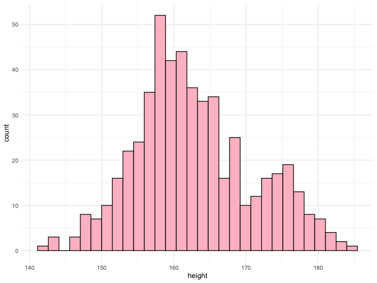
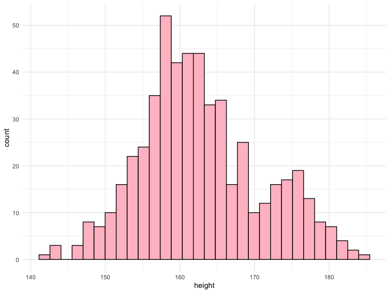
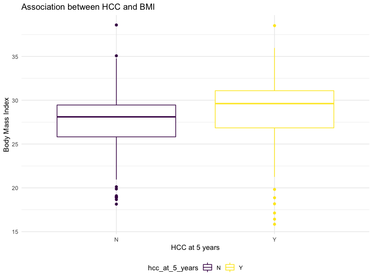

Practice 2
================
Ekta Chaudhary
28/06/2020

``` r
path <- '/Users/ektachaudhary/Documents/practice_ex_2/Data/'
files = list.files(path = path, pattern = "*.csv", full.names = TRUE)
```

\#Reading the datasets

``` r
dat_csv = ldply(files, read_csv) %>%
  janitor::clean_names()
```

    ## Parsed with column specification:
    ## cols(
    ##   X1 = col_double(),
    ##   `HCC at 5 years` = col_character(),
    ##   Age = col_double(),
    ##   Weight = col_double(),
    ##   Height = col_double(),
    ##   Alcohol = col_double(),
    ##   `Number of prior treatments for cirrhosis` = col_double()
    ## )

    ## Parsed with column specification:
    ## cols(
    ##   X1 = col_double(),
    ##   `HCC at 5 years` = col_character(),
    ##   Age = col_double(),
    ##   Weight = col_double(),
    ##   Height = col_double(),
    ##   Alcohol = col_double(),
    ##   Comorbidities = col_character(),
    ##   `Number of prior treatments for cirrhosis` = col_double()
    ## )
    ## Parsed with column specification:
    ## cols(
    ##   X1 = col_double(),
    ##   `HCC at 5 years` = col_character(),
    ##   Age = col_double(),
    ##   Weight = col_double(),
    ##   Height = col_double(),
    ##   Alcohol = col_double(),
    ##   Comorbidities = col_character(),
    ##   `Number of prior treatments for cirrhosis` = col_double()
    ## )
    ## Parsed with column specification:
    ## cols(
    ##   X1 = col_double(),
    ##   `HCC at 5 years` = col_character(),
    ##   Age = col_double(),
    ##   Weight = col_double(),
    ##   Height = col_double(),
    ##   Alcohol = col_double(),
    ##   Comorbidities = col_character(),
    ##   `Number of prior treatments for cirrhosis` = col_double()
    ## )
    ## Parsed with column specification:
    ## cols(
    ##   X1 = col_double(),
    ##   `HCC at 5 years` = col_character(),
    ##   Age = col_double(),
    ##   Weight = col_double(),
    ##   Height = col_double(),
    ##   Alcohol = col_double(),
    ##   Comorbidities = col_character(),
    ##   `Number of prior treatments for cirrhosis` = col_double()
    ## )
    ## Parsed with column specification:
    ## cols(
    ##   X1 = col_double(),
    ##   `HCC at 5 years` = col_character(),
    ##   Age = col_double(),
    ##   Weight = col_double(),
    ##   Height = col_double(),
    ##   Alcohol = col_double(),
    ##   Comorbidities = col_character(),
    ##   `Number of prior treatments for cirrhosis` = col_double()
    ## )
    ## Parsed with column specification:
    ## cols(
    ##   X1 = col_double(),
    ##   `HCC at 5 years` = col_character(),
    ##   Age = col_double(),
    ##   Weight = col_double(),
    ##   Height = col_double(),
    ##   Alcohol = col_double(),
    ##   Comorbidities = col_character(),
    ##   `Number of prior treatments for cirrhosis` = col_double()
    ## )
    ## Parsed with column specification:
    ## cols(
    ##   X1 = col_double(),
    ##   `HCC at 5 years` = col_character(),
    ##   Age = col_double(),
    ##   Weight = col_double(),
    ##   Height = col_double(),
    ##   Alcohol = col_double(),
    ##   Comorbidities = col_character(),
    ##   `Number of prior treatments for cirrhosis` = col_double()
    ## )
    ## Parsed with column specification:
    ## cols(
    ##   X1 = col_double(),
    ##   `HCC at 5 years` = col_character(),
    ##   Age = col_double(),
    ##   Weight = col_double(),
    ##   Height = col_double(),
    ##   Alcohol = col_double(),
    ##   Comorbidities = col_character(),
    ##   `Number of prior treatments for cirrhosis` = col_double()
    ## )
    ## Parsed with column specification:
    ## cols(
    ##   X1 = col_double(),
    ##   `HCC at 5 years` = col_character(),
    ##   Age = col_double(),
    ##   Weight = col_double(),
    ##   Height = col_double(),
    ##   Alcohol = col_double(),
    ##   Comorbidities = col_character(),
    ##   `Number of prior treatments for cirrhosis` = col_double()
    ## )
    ## Parsed with column specification:
    ## cols(
    ##   X1 = col_double(),
    ##   `HCC at 5 years` = col_character(),
    ##   Age = col_double(),
    ##   Weight = col_double(),
    ##   Height = col_double(),
    ##   Alcohol = col_double(),
    ##   Comorbidities = col_character(),
    ##   `Number of prior treatments for cirrhosis` = col_double()
    ## )
    ## Parsed with column specification:
    ## cols(
    ##   X1 = col_double(),
    ##   `HCC at 5 years` = col_character(),
    ##   Age = col_double(),
    ##   Weight = col_double(),
    ##   Height = col_double(),
    ##   Alcohol = col_double(),
    ##   Comorbidities = col_character(),
    ##   `Number of prior treatments for cirrhosis` = col_double()
    ## )

``` r
dat_csv 
```

    ##      x1 hcc_at_5_years  age  weight height alcohol
    ## 1     1              N 51.7  68.723 156.99       9
    ## 2     2              Y 59.6  76.644 160.79       8
    ## 3     3              N 57.0  74.014 159.53      17
    ## 4     4              N 69.1  86.085 165.32       2
    ## 5     5              N 59.5  76.462 160.70      14
    ## 6     6              N 62.0  78.983 161.91      15
    ## 7     7              N 50.7  67.728 156.51      24
    ## 8     8              Y 66.9  83.932 164.29      11
    ## 9     9              N 47.7  64.684 155.05      16
    ## 10   10              Y 53.5  70.502 157.84       5
    ## 11   11              N 59.1  76.124 160.54      19
    ## 12   12              Y 59.2  76.203 160.58      26
    ## 13    1              Y 74.2  91.222 167.79       5
    ## 14    2              N 57.1  74.116 159.58      19
    ## 15    3              N 52.7  69.740 157.48       5
    ## 16    4              N 72.3  89.267 166.85      11
    ## 17    5              N 52.7  69.661 157.44      NA
    ## 18    6              Y 75.4  92.446 168.37      27
    ## 19    7              N 54.3  71.298 158.22       7
    ## 20    8              Y 65.3  82.283 163.50      30
    ## 21    9              N 52.2  79.949 143.94       1
    ## 22   10              N 40.5  57.492 151.60       3
    ## 23   11              Y 99.3 116.302 179.82       7
    ## 24   12              Y 68.7  85.710 165.14      22
    ## 25   13              Y 72.5  89.513 166.97       1
    ## 26   14              Y 61.5  78.487 161.67      16
    ## 27   15              Y 57.8  74.831 159.92      20
    ## 28   16              Y 52.1  79.798 143.94       9
    ## 29   17              Y 59.5  76.516 160.73      12
    ## 30   18              N 51.7  68.743 157.00      22
    ## 31    1              Y 75.2  92.246 168.28      29
    ## 32    2              Y 52.9  69.925 157.56      23
    ## 33    3              Y 75.4  92.449 168.38      17
    ## 34    4              Y 67.2  84.232 164.43      14
    ## 35    5              Y 67.2  84.208 164.42      11
    ## 36    6              N 48.8  65.836 155.60      NA
    ## 37    7              Y 34.3  51.270 148.61       6
    ## 38    8              N 63.6  80.573 162.68       4
    ## 39    9              Y 63.7  80.703 162.74      12
    ## 40   10              N 38.9  55.923 150.84       8
    ## 41   11              N 57.0  73.993 159.52      21
    ## 42   12              N 53.7  70.750 157.96      12
    ## 43   13              N 58.7  75.671 160.32      NA
    ## 44   14              N 49.4  66.355 155.85      12
    ## 45   15              N 54.2  71.206 158.18       6
    ## 46   16              N 43.1  60.062 152.83      NA
    ## 47   17              Y 70.7  87.747 166.12      16
    ## 48   18              N 52.0  69.019 157.13      12
    ## 49   19              Y 49.8  66.756 156.04      17
    ## 50   20              Y 66.5  83.486 164.07      29
    ## 51   21              N 56.7  73.683 159.37      20
    ## 52   22              N 52.3  69.329 157.28      10
    ## 53   23              Y 74.8  91.768 168.05      10
    ## 54   24              Y 70.3  87.324 165.92      28
    ## 55   25              N 43.1  60.057 152.83      11
    ## 56   26              N 50.8  67.814 156.55      17
    ## 57   27              Y 70.3  87.275 165.89      15
    ## 58   28              N 37.3  54.283 150.06       4
    ## 59   29              N 44.0  61.004 153.28       7
    ## 60   30              N 43.4  60.365 152.98      22
    ## 61   31              N 43.8  60.762 153.17       9
    ## 62   32              N 41.9  58.940 152.29      15
    ## 63   33              Y 56.2  73.228 159.15       8
    ## 64   34              N 76.0  92.985 168.63      11
    ## 65   35              N 45.0  61.999 153.76      13
    ## 66   36              N 45.2  62.202 153.86      24
    ## 67   37              Y 71.7  88.685     NA      NA
    ## 68   38              N 32.8  49.826 147.92      21
    ## 69   39              N 44.9  61.918 153.72      25
    ## 70   40              Y 68.4  85.418 165.00      25
    ## 71   41              Y 65.6  82.608 163.65      12
    ## 72   42              Y 71.6  88.551 166.50       5
    ## 73   43              Y 60.2  77.159 161.04      19
    ## 74   44              N 77.0  93.952 169.10       9
    ## 75   45              Y 55.3  72.285 158.70      28
    ## 76   46              Y 56.6  73.647 159.35       5
    ## 77   47              N 53.5  70.529 157.85      29
    ## 78   48              Y 62.1  79.088 161.96       0
    ## 79   49              Y 32.8  49.838 147.92      21
    ## 80   50              N 56.1  73.129 159.10      19
    ## 81   51              Y 46.3  63.348 154.41      23
    ## 82   52              Y 61.5  78.480 161.67      27
    ## 83   53              Y 68.2  85.210 164.90      15
    ## 84   54              N 52.6  69.622 157.42      22
    ## 85   55              N 65.2  82.154 163.43      28
    ## 86   56              Y 60.2  77.212 161.06       3
    ## 87   57              Y 71.9  88.920 166.68      15
    ## 88    1              N 50.7  67.661 172.65       6
    ## 89    2              N 36.3  53.272 168.05      30
    ## 90    3              Y 66.2  83.171 177.61       1
    ## 91    4              Y 55.7  72.667 174.25       7
    ## 92    5              Y 66.0  82.992 177.56      27
    ## 93    6              Y 57.6  74.602 174.87       4
    ## 94    7              Y 70.5  87.528 179.01      11
    ## 95    8              N 50.0  66.987 172.44       5
    ## 96    9              N 61.1  78.138 176.00       5
    ## 97   10              Y 65.2  82.188 177.30      29
    ## 98   11              N 50.1  67.062 172.46      24
    ## 99   12              Y 68.7  85.716 178.43      29
    ## 100  13              Y 71.8  88.811 179.42      12
    ## 101  14              Y 27.9  44.935 165.38      26
    ## 102  15              N 49.2  66.238 172.20      NA
    ## 103  16              N 58.4  75.356 175.11       9
    ## 104  17              Y 79.5  96.469 181.87      15
    ## 105  18              N 43.9  60.896 170.49      19
    ## 106  19              Y 71.6  88.578 179.34      NA
    ## 107  20              N 74.3  91.324 180.22      24
    ## 108  21              N 45.6  62.647 171.05      17
    ## 109  22              N 55.2  72.157 174.09      11
    ## 110  23              Y 56.2  73.224 174.43      20
    ## 111  24              Y 63.0  79.950 176.58       7
    ## 112  25              N 33.8  50.757 167.24       8
    ## 113  26              N 43.4  68.653 161.72      16
    ## 114  27              Y 69.8  86.776 178.77      22
    ## 115  28              N 58.5  75.464 175.15      23
    ## 116  29              N 54.8  71.768 173.97       3
    ## 117  30              N 62.3  79.305 176.38      18
    ## 118  31              N 59.9  76.867 175.60      27
    ## 119  32              Y 69.8  86.756 178.76      19
    ## 120  33              Y 30.3  47.276 166.13       8
    ## 121  34              N 35.6  52.581 167.83      11
    ## 122  35              N 79.2  96.151 181.77      20
    ## 123  36              N 37.1  54.094 168.31      27
    ## 124  37              Y 36.3  53.285 168.05      22
    ## 125  38              Y 57.7  74.667 174.89      NA
    ## 126  39              N 58.8  75.823 175.26      11
    ## 127  40              Y 39.7  56.721 169.15      26
    ## 128  41              N 52.8  69.757 173.32       2
    ## 129  42              N 65.2  82.211 177.31       8
    ## 130  43              Y 50.4  67.413 172.57      11
    ## 131  44              N 57.1  74.135 174.72      11
    ## 132  45              Y 74.7  91.674 180.34       8
    ## 133  46              N 48.4  65.403 171.93      12
    ## 134  47              N 64.9  81.915 177.21      10
    ## 135  48              N 36.6  53.642 168.17       8
    ## 136  49              N 51.4  68.416 172.89      24
    ## 137  50              Y 83.8 100.797 183.26      30
    ## 138  51              N 63.3  80.297 176.69      NA
    ## 139  52              Y 70.6  87.607 179.03      18
    ## 140  53              Y 75.0  92.014 180.44      18
    ## 141  54              N 56.7  73.676 174.58      17
    ## 142  55              Y 58.5  75.519 175.17       7
    ## 143  56              Y 72.0  88.999 179.48      14
    ## 144  57              Y 61.0  77.990 175.96      30
    ## 145  58              N 45.0  62.011 170.84       2
    ## 146  59              Y 51.9  68.853 173.03       2
    ## 147  60              Y 62.8  79.802 176.54      15
    ## 148  61              Y 56.2  73.157 174.41       2
    ## 149  62              Y 49.9  66.869 172.40      29
    ## 150  63              N 58.7  75.704 175.23      19
    ## 151  64              Y 54.9  71.917 174.01       8
    ## 152  65              N 73.5  90.453 179.94      30
    ## 153  66              Y 55.8  72.771 174.29      11
    ## 154  67              N 73.5  90.456 179.95      11
    ## 155  68              N 44.5  61.473 170.67      10
    ## 156  69              N 51.8  68.823 173.02       3
    ## 157  70              N 36.6  53.611 168.16      17
    ## 158  71              N 58.5  75.501 175.16      10
    ## 159  72              N 51.0  67.986 172.76       0
    ## 160  73              Y 26.0  43.033 164.77      30
    ## 161  74              N 49.3  66.290 172.21      11
    ## 162  75              N 39.9  56.921 169.21       7
    ## 163  76              Y 61.9  78.948 176.26      22
    ## 164  77              Y 53.7  70.716 173.63       9
    ## 165  78              Y 33.9  50.858 167.27      12
    ## 166  79              N 61.0  78.035 175.97      12
    ## 167  80              N 53.5  70.465 173.55      13
    ## 168  81              Y 88.4 105.409 184.73      23
    ## 169  82              Y 65.4  82.401 177.37       6
    ## 170  83              N 50.8  67.797 172.70      22
    ## 171  84              N 63.1  80.083 176.63      18
    ## 172  85              Y 57.4  74.434 174.82      10
    ## 173  86              Y 63.5  80.511 176.76      11
    ## 174  87              N 85.9 102.942 183.94       1
    ## 175  88              N 50.7  67.673 172.66      15
    ## 176  89              Y 65.5  82.492 177.40      29
    ## 177  90              Y 73.9  90.928 180.10       0
    ## 178  91              Y 46.6  63.603 171.35       3
    ## 179  92              N 40.8  57.807 169.50      13
    ## 180  93              N 54.4  71.403 173.85       9
    ## 181  94              N 59.0  76.019 175.33      29
    ## 182  95              Y 62.2  79.224 176.35      18
    ## 183  96              Y 65.1  82.077 177.26      22
    ## 184  97              Y 46.3  63.322 171.26      20
    ## 185  98              Y 79.6  96.585 181.91      22
    ## 186  99              Y 77.9  94.854 181.35       3
    ## 187 100              Y 45.0  62.032 170.85       7
    ## 188 101              Y 62.6  79.619 176.48      19
    ## 189 102              Y 63.5  80.483 176.75      29
    ## 190   1              N 55.5  72.480 158.79       8
    ## 191   2              Y 67.2  84.248 164.44      12
    ## 192   3              N 59.5  76.542 160.74      23
    ## 193   4              N 57.6  74.634 159.82      20
    ## 194   5              N 53.1  70.139 157.67       6
    ## 195   6              Y 64.4  81.386 163.07      11
    ## 196   7              N 46.6  63.577 154.52      11
    ## 197   8              Y 86.9 103.879 173.86      21
    ## 198   9              N 52.5  69.524 157.37      16
    ## 199  10              Y 67.6  84.551 164.58      21
    ## 200  11              N 61.3  78.275 161.57      16
    ## 201  12              Y 67.7  84.668 164.64      22
    ## 202  13              Y 47.8  64.820 155.11      13
    ## 203  14              N 52.5  69.519 157.37       5
    ## 204  15              N 49.0  65.997 155.68      23
    ## 205  16              Y 60.9  77.887 161.39      26
    ## 206  17              N 43.5  60.528     NA      NA
    ## 207  18              Y 61.1  78.088 161.48       8
    ## 208  19              N 56.9  73.861 159.45      15
    ## 209  20              N 80.0  96.967 170.54      28
    ## 210  21              Y 56.3  73.276 159.17      10
    ## 211  22              N 56.6  73.610 159.33      29
    ## 212  23              N 49.4  66.375 155.86      21
    ## 213  24              N 55.2  72.228 158.67      27
    ## 214  25              Y 60.3  77.286 161.10       5
    ## 215  26              Y 63.2  80.217 162.50      19
    ## 216  27              N 71.3  88.318 166.39      30
    ## 217  28              N 70.1  87.128 165.82       4
    ## 218  29              N 56.7  73.730 159.39      10
    ## 219  30              Y 75.5  92.540 168.42      26
    ## 220  31              N 35.8  52.790 149.34      23
    ## 221  32              Y 65.8  82.786 163.74      25
    ## 222  33              N 51.5  68.471 156.87      18
    ## 223   1              Y 74.5  91.528 167.93      15
    ## 224   2              Y 53.5  70.457 157.82      23
    ## 225   3              N 74.5  91.488 167.91      27
    ## 226   4              N 58.5  75.547 160.26       6
    ## 227   5              Y 34.5  51.517 148.73       9
    ## 228   6              N 52.4  69.412 157.32      10
    ## 229   7              N 36.3  53.268 149.57       6
    ## 230   8              Y 60.2  77.236 161.07       7
    ## 231   9              Y 81.7  98.718 171.38       8
    ## 232  10              Y 29.6  46.601 146.37      18
    ## 233  11              Y 70.3  87.256 165.88       8
    ## 234  12              N 40.5  57.515 151.61       4
    ## 235  13              Y 80.8  97.811 170.95       7
    ## 236  14              Y 75.3  92.266 168.29      18
    ## 237  15              Y 47.5  64.514 154.97       6
    ## 238  16              N 54.7  71.725 158.43      14
    ## 239  17              Y 57.1  74.139 159.59      19
    ## 240  18              N 53.3  70.264 157.73      29
    ## 241  19              Y 90.3 107.274 175.49      20
    ## 242  20              N 59.6  76.623 160.78      13
    ## 243  21              N 49.1  66.087 155.72      11
    ## 244  22              N 66.0  82.975 163.83      14
    ## 245  23              Y 60.5  77.521 161.21      13
    ## 246  24              Y 57.1  74.126 159.58       7
    ## 247  25              Y 56.8  73.844 159.45      21
    ## 248  26              Y 63.6  80.611 162.69      12
    ## 249  27              N 44.7  61.696 153.61      10
    ## 250  28              N 43.5  60.470 153.03      17
    ## 251  29              Y 78.6  95.607 169.89      29
    ## 252  30              N 32.2  49.224 147.63      20
    ## 253  31              N 58.2  75.159 160.08      19
    ## 254  32              N 44.4  61.406 153.47      26
    ## 255  33              N 61.4  78.382 161.62      23
    ## 256  34              N 70.6  87.606 166.05      25
    ## 257  35              Y 32.1  49.070 147.55       3
    ## 258  36              Y 69.2  86.210 165.38      14
    ## 259  37              Y 57.4  74.375 159.70      18
    ## 260  38              N 41.2  58.183 151.93      28
    ## 261  39              Y 33.9  50.860 148.41      29
    ## 262  40              Y 66.9  83.870 164.26       1
    ## 263  41              N 56.0  73.026 159.05      NA
    ## 264  42              N 60.7  77.705 161.30      NA
    ## 265  43              N 68.2  85.217 164.90       7
    ## 266  44              Y 79.6  96.590 170.36       9
    ## 267  45              N 56.7  73.703 159.38      22
    ## 268  46              Y 51.0  68.036 156.66      NA
    ## 269  47              Y 75.9  92.854 168.57       6
    ## 270   1              N 46.8  63.838 154.64      11
    ## 271   2              N 43.5  60.530 153.05      13
    ## 272   3              N 51.4  68.371 156.82      27
    ## 273   4              N 88.6 105.571 174.67      12
    ## 274   5              N 47.6  64.594 155.01      16
    ## 275   6              Y 63.2  80.169 162.48       4
    ## 276   7              Y 43.3  60.266 152.93       1
    ## 277   8              Y 43.3  60.325 152.96      23
    ## 278   9              N 53.8  70.838 158.00      10
    ## 279  10              N 75.0  92.039 168.18      12
    ## 280  11              N 52.1  69.136 157.19      NA
    ## 281  12              N 68.5  85.536 165.06      11
    ## 282  13              Y 39.8  56.775 151.25      17
    ## 283  14              N 53.0  69.996 157.60      21
    ## 284  15              N 48.3  65.295 155.34      29
    ## 285  16              Y 53.4  70.384 157.78      21
    ## 286  17              N 73.5  90.501 167.44       0
    ## 287  18              N 56.7  73.657 159.36      16
    ## 288   1              Y 60.2  77.157 161.04      25
    ## 289   2              Y 61.2  78.183 161.53      24
    ## 290   3              N 50.3  67.318 156.31       2
    ## 291   4              Y 40.1  57.135 151.42       7
    ## 292   5              N 53.9  70.863 158.01      29
    ## 293   6              Y 59.6  76.605 160.77       1
    ## 294   7              Y 70.7  87.726 166.11      27
    ## 295   8              Y 54.8  71.805 158.47      22
    ## 296   9              N 54.2  71.218 158.18       6
    ## 297  10              N 78.2  95.190 169.69      25
    ## 298  11              Y 48.3  65.329 155.36      12
    ## 299  12              Y 63.3  80.300 162.54      12
    ## 300  13              N 50.7  67.701 156.50      14
    ## 301  14              Y 63.2  80.188 162.49      18
    ## 302  15              Y 38.7  55.684 150.73      11
    ## 303  16              N 51.5  68.516 156.89       1
    ## 304  17              N 54.5  71.503 158.32      30
    ## 305  18              Y 70.6  87.593 166.04      29
    ## 306  19              Y 52.1  69.130 157.18      17
    ## 307  20              Y 61.7  78.724     NA      NA
    ## 308  21              N 52.8  69.778 157.49       7
    ## 309  22              N 47.4  64.370 154.90      26
    ## 310  23              Y 66.6  83.613 164.13      22
    ## 311  24              N 52.2  69.248 157.24      15
    ## 312  25              N 74.9  91.852 168.09      17
    ## 313  26              Y 63.5  80.538 162.66       0
    ## 314  27              N 56.1  73.113 159.09      14
    ## 315  28              N 63.7  80.694 162.73       1
    ## 316  29              N 57.5  74.498 159.76      14
    ## 317  30              N 63.7  80.702 162.74      NA
    ## 318  31              N 52.9  69.895 157.55      NA
    ## 319  32              N 31.3  48.294 147.18       3
    ## 320  33              N 60.0  76.960 160.94       4
    ## 321  34              N 66.3  83.251 163.96      27
    ## 322  35              N 45.7  62.727 154.11       4
    ## 323  36              Y 44.1  61.079 153.32      22
    ## 324  37              N 52.5  69.533 157.38      29
    ## 325  38              N 51.5  68.549 156.90       1
    ## 326  39              N 63.2  80.237 162.51       1
    ## 327  40              Y 59.7  76.677 160.80       6
    ## 328  41              Y 70.9  87.934 166.21      15
    ## 329  42              N 78.7  95.669 169.92      28
    ## 330  43              Y 57.8  74.776 159.89       4
    ## 331  44              Y 57.7  74.697 159.85       5
    ## 332  45              N 61.1  78.128     NA      NA
    ## 333  46              N 53.8  70.786 157.98      24
    ## 334  47              N 56.6  73.583 159.32      25
    ## 335  48              N 56.8  73.764 159.41      24
    ## 336  49              N 61.3  78.301 161.58       1
    ## 337  50              N 59.7  76.737 160.83      21
    ## 338  51              N 55.0  71.972 158.55      24
    ## 339  52              N 58.7  75.738 160.35      17
    ## 340  53              N 55.8  72.784 158.94      14
    ## 341  54              Y 67.9  84.934 164.77       5
    ## 342  55              N 58.1  75.084 160.04       3
    ## 343  56              Y 50.1  67.128 156.22       5
    ## 344  57              N 54.8  71.844 158.49       1
    ## 345  58              Y 49.4  66.370 155.86      21
    ## 346  59              Y 60.5  77.532 161.22      23
    ## 347  60              Y 68.6  85.580 165.08      26
    ## 348  61              Y 65.9  82.901 163.79      13
    ## 349  62              Y 60.5  77.518 161.21      13
    ## 350  63              Y 56.9  73.862 159.45      18
    ## 351  64              N 61.6  78.619 161.74      25
    ## 352  65              N 57.3  74.316 159.67      NA
    ## 353  66              Y 32.5  49.477 147.75      10
    ## 354  67              N 62.5  79.480 162.15      29
    ## 355  68              N 53.3  70.342 157.76      20
    ## 356  69              Y 73.9  90.854 167.61      NA
    ## 357  70              Y 85.1 102.108 173.01      NA
    ## 358  71              Y 42.5  59.503 152.56       9
    ## 359  72              Y 65.4  82.373 163.54      22
    ## 360  73              N 59.6  76.550 160.74      28
    ## 361  74              Y 51.5  68.454 156.86      20
    ## 362  75              N 65.8  82.753 163.72       6
    ## 363  76              Y 66.9  83.853     NA      NA
    ## 364  77              N 56.8  73.835 159.44       4
    ## 365  78              N 54.3  71.310 158.23       3
    ## 366  79              N 44.4  61.427 153.49       9
    ## 367  80              N 50.2  67.190 156.25      25
    ## 368  81              Y 55.1  72.087 158.60      30
    ## 369  82              N 54.9  71.865 158.50      13
    ## 370   1              Y 69.9  86.924 165.72       6
    ## 371   2              N 54.7  71.675 158.40      29
    ## 372   3              Y 81.7  98.691 171.37      20
    ## 373   4              Y 52.6  69.625 157.42       9
    ## 374   5              N 77.7  94.694 169.45       4
    ## 375   6              N 60.0  77.024 160.97      18
    ## 376   7              Y 44.4  61.432 153.49       4
    ## 377   8              Y 65.2  82.212 163.46      NA
    ## 378   9              Y 58.4  75.352 160.17      11
    ## 379  10              Y 53.5  70.541 157.86      29
    ## 380  11              Y 68.7  85.658 165.12      27
    ## 381  12              Y 64.4  81.417 163.08      25
    ## 382  13              Y 70.7  87.728 166.11      10
    ## 383  14              N 45.2  62.232 153.87      26
    ## 384  15              N 51.0  67.979 156.63      24
    ## 385  16              N 45.3  62.343 153.92      18
    ## 386  17              Y 31.6  53.549 141.88       2
    ## 387  18              Y 62.2  79.154 161.99      13
    ## 388  19              N 73.5  90.506 167.44      NA
    ## 389  20              N 66.4  83.392 164.03      23
    ## 390  21              N 41.4  58.375 152.02       7
    ## 391  22              Y 47.4  64.368 154.90       9
    ## 392  23              N 35.6  52.640 149.27      11
    ## 393  24              Y 73.4  90.394 167.39      19
    ## 394  25              Y 53.8  70.820 157.99      27
    ## 395  26              Y 45.9  62.908 154.20      22
    ## 396  27              Y 69.0  85.992 165.28      14
    ## 397  28              Y 54.8  71.830 158.48       1
    ## 398   1              N 39.0  56.027 150.89      17
    ## 399   2              N 57.7  74.701 159.86      13
    ## 400   3              N 58.3  75.333 160.16      18
    ## 401   4              N 60.0  77.046 160.98      29
    ## 402   5              Y 63.1  80.125 162.46       8
    ## 403   6              N 50.2  67.158 156.24      20
    ## 404   7              Y 66.0  82.961 163.82       2
    ## 405   8              Y 43.0  59.976 152.79       2
    ## 406   9              Y 74.8  91.832 168.08      11
    ## 407  10              N 50.5  67.515 156.41       9
    ## 408  11              N 63.5  80.528 162.65      17
    ## 409  12              Y 65.7  82.669 163.68      11
    ## 410  13              N 54.3  71.261 158.21      25
    ## 411  14              Y 38.0  54.993 150.40      19
    ## 412  15              N 53.8  70.757     NA      NA
    ## 413  16              N 50.7  67.734 156.51       9
    ## 414  17              N 53.1  70.120 157.66      11
    ## 415  18              Y 68.6  85.569 165.07      21
    ## 416  19              Y 66.6  83.559 164.11      28
    ## 417  20              N 61.0  77.971 161.43      23
    ## 418  21              N 49.1  66.117 155.74       7
    ## 419  22              Y 90.7 107.666     NA      NA
    ## 420  23              N 37.7  54.667 150.24      20
    ## 421  24              N 37.9  54.909 150.36      21
    ## 422  25              N 62.3  79.254 162.04      NA
    ## 423  26              N 92.1 109.099 176.37      21
    ## 424  27              Y 53.9  70.910 158.04      20
    ## 425  28              Y 42.3  59.289 152.46       1
    ## 426  29              N 52.6  69.608 157.41       2
    ## 427  30              N 89.9 106.861 175.29       8
    ## 428  31              N 48.4  65.357 155.37       9
    ## 429  32              Y 51.7  68.658 156.96      29
    ## 430  33              N 54.6  71.625 158.38      12
    ## 431  34              Y 67.4  84.351 164.49      11
    ## 432  35              Y 66.4  83.357 164.01      25
    ## 433   1              Y 52.3  69.309 157.27      25
    ## 434   2              Y 33.9  50.902 148.43      10
    ## 435   3              Y 81.5  98.525 171.29       4
    ## 436   4              N 42.4  59.379 152.50      19
    ## 437   5              Y 51.9  68.883 157.06      24
    ## 438   6              Y 60.7  77.692 161.29      10
    ## 439   7              Y 63.3  80.276 162.53      27
    ## 440   8              Y 42.7  59.736 152.67       6
    ## 441   9              Y 61.9  78.903 161.87      24
    ## 442  10              Y 69.1  86.081 165.32      23
    ## 443  11              N 63.9  80.935 162.85      27
    ## 444  12              Y 68.9  85.873 165.22      10
    ## 445  13              Y 46.9  63.918 154.68      NA
    ## 446  14              N 56.4  73.392 159.23      27
    ## 447  15              Y 71.7  88.706 166.58      NA
    ## 448  16              Y 64.5  81.475 163.11      20
    ## 449  17              Y 63.0  79.975 162.39      22
    ## 450  18              Y 71.3  88.333 166.40      13
    ## 451  19              N 52.4  69.381 157.30      NA
    ## 452  20              Y 65.8  82.826 163.76      NA
    ## 453  21              Y 47.8  64.765 155.09      22
    ## 454  22              Y 54.7  71.706     NA      NA
    ## 455  23              N 59.9  76.932 160.93       5
    ## 456  24              Y 65.1  82.106 163.41      20
    ## 457  25              Y 41.7  66.478 144.04       8
    ## 458  26              Y 72.2  89.207 166.82      10
    ## 459  27              N 63.3  80.272 162.53       6
    ## 460  28              N 74.9  91.876 168.10       0
    ## 461  29              N 71.8  88.797 166.62      11
    ## 462  30              Y 66.1  83.088 163.88      17
    ## 463  31              Y 60.2  77.195 161.05      20
    ## 464  32              Y 66.2  83.169 163.92      22
    ## 465   1              Y 57.2  74.181 159.61      29
    ## 466   2              Y 66.1  83.069 163.87       5
    ## 467   3              Y 62.6  79.554 162.19      10
    ## 468   4              Y 68.5  85.543 165.06       4
    ## 469   5              N 49.5  66.544 155.94      19
    ## 470   6              N 53.1  70.107 157.65      10
    ## 471   7              N 63.1  80.062 162.43      19
    ## 472   8              N 44.2  61.164 153.36       9
    ## 473   9              N 53.2  70.209 157.70       2
    ## 474  10              Y 61.7  78.675 161.76      20
    ## 475  11              Y 80.4  97.413 170.76      23
    ## 476  12              Y 68.2  85.175 164.88      17
    ## 477  13              N 41.5  58.500 152.08      16
    ## 478  14              Y 34.8  51.807 148.87      25
    ## 479  15              N 45.3  62.268 153.89      20
    ## 480  16              N 44.9  61.936 153.73      29
    ## 481  17              N 49.9  66.859 156.09      19
    ## 482  18              N 62.8  79.784 162.30      15
    ## 483  19              Y 70.9  87.899 166.19      29
    ## 484  20              N 59.6  76.638 160.79      15
    ## 485  21              Y 62.7  79.715 162.26      20
    ## 486  22              Y 34.4  51.404 148.67      18
    ## 487  23              Y 64.5  81.503 163.12      28
    ## 488  24              Y 68.7  85.739 165.15      11
    ## 489  25              N 48.0  64.969 155.19      26
    ## 490  26              Y 51.9  68.850 157.05      NA
    ## 491  27              N 55.4  72.363 158.73      15
    ## 492  28              Y 52.2  69.204 157.22      NA
    ## 493  29              N 61.7  78.743 161.80      19
    ## 494  30              Y 50.4  67.432 156.37      18
    ## 495  31              N 52.5  69.512 157.37      24
    ## 496  32              N 49.0  65.991 155.68      17
    ## 497  33              Y 67.8  84.760 164.68      23
    ## 498  34              N 42.7  59.721 152.67      12
    ## 499  35              Y 69.1  86.140 165.35      15
    ## 500  36              Y 61.2  78.174 161.52      16
    ## 501  37              Y 57.2  74.177 159.61      30
    ## 502  38              Y 60.5  77.518 161.21      13
    ## 503  39              N 89.0 105.971 174.87      30
    ## 504  40              Y 63.9  80.897 162.83      24
    ## 505  41              N 74.6  91.577 167.96      15
    ## 506  42              N 66.4  83.357 164.01      15
    ## 507  43              Y 56.3  73.283 159.18      27
    ## 508  44              Y 40.4  57.360 151.53       8
    ## 509  45              Y 73.0  90.005 167.20       5
    ## 510  46              Y 61.7  78.739 161.79      12
    ## 511  47              Y 63.7  80.703 162.74      16
    ## 512  48              Y 63.5  80.476 162.63      NA
    ## 513  49              N 55.3  72.312 158.71      11
    ## 514  50              N 54.1  71.098 158.13      17
    ## 515  51              N 49.3  66.342 155.84       6
    ## 516  52              N 28.0  45.047 145.62      24
    ## 517  53              N 38.2  55.197 150.49      19
    ## 518  54              N 80.0  96.984 170.55      22
    ## 519  55              Y 28.5  45.464 145.82      13
    ## 520  56              Y 62.9  79.915 162.36      17
    ## 521  57              N 65.1  82.074 163.40       8
    ## 522  58              Y 45.0  61.950 153.74      NA
    ## 523  59              N 70.8  87.789 166.14       5
    ## 524  60              Y 51.6  68.592 156.92      18
    ## 525  61              N 58.6  75.597 160.29      NA
    ## 526  62              Y 75.4  92.411 168.36      14
    ## 527  63              Y 52.6  69.594 157.41      23
    ## 528  64              N 56.3  73.310 159.19       1
    ##     number_of_prior_treatments_for_cirrhosis             comorbidities
    ## 1                                          1                      <NA>
    ## 2                                          0                      <NA>
    ## 3                                          2                      <NA>
    ## 4                                          2                      <NA>
    ## 5                                          0                      <NA>
    ## 6                                          2                      <NA>
    ## 7                                          1                      <NA>
    ## 8                                          0                      <NA>
    ## 9                                          3                      <NA>
    ## 10                                         0                      <NA>
    ## 11                                         3                      <NA>
    ## 12                                         2                      <NA>
    ## 13                                         0              Hypertension
    ## 14                                         0                  Diabetes
    ## 15                                         1 Diabetes and hypertension
    ## 16                                         2 Diabetes and hypertension
    ## 17                                         2 Diabetes and hypertension
    ## 18                                         1              Hypertension
    ## 19                                         1 Diabetes and hypertension
    ## 20                                         0 Diabetes and hypertension
    ## 21                                         2 Diabetes and hypertension
    ## 22                                         1 Diabetes and hypertension
    ## 23                                         1 Diabetes and hypertension
    ## 24                                         2              Hypertension
    ## 25                                         0 Diabetes and hypertension
    ## 26                                         1              Hypertension
    ## 27                                         0 Diabetes and hypertension
    ## 28                                         1                  Diabetes
    ## 29                                         0              Hypertension
    ## 30                                         2              Hypertension
    ## 31                                         0              Hypertension
    ## 32                                         1                  Diabetes
    ## 33                                         0 Diabetes and hypertension
    ## 34                                         0              Hypertension
    ## 35                                         0              Hypertension
    ## 36                                         0                  Diabetes
    ## 37                                         2 Diabetes and hypertension
    ## 38                                         3              Hypertension
    ## 39                                         2 Diabetes and hypertension
    ## 40                                         2 Diabetes and hypertension
    ## 41                                         2 Diabetes and hypertension
    ## 42                                         2 Diabetes and hypertension
    ## 43                                         2 Diabetes and hypertension
    ## 44                                         0                  Diabetes
    ## 45                                         3              Hypertension
    ## 46                                         3              Hypertension
    ## 47                                         2              Hypertension
    ## 48                                         2 Diabetes and hypertension
    ## 49                                         0              Hypertension
    ## 50                                         0              Hypertension
    ## 51                                         0                  Diabetes
    ## 52                                         3              Hypertension
    ## 53                                         2                  Diabetes
    ## 54                                         3              Hypertension
    ## 55                                         2 Diabetes and hypertension
    ## 56                                         1 Diabetes and hypertension
    ## 57                                         2              Hypertension
    ## 58                                         0                  Diabetes
    ## 59                                         3              Hypertension
    ## 60                                         2 Diabetes and hypertension
    ## 61                                         3              Hypertension
    ## 62                                         3              Hypertension
    ## 63                                         0              Hypertension
    ## 64                                         3              Hypertension
    ## 65                                         2              Hypertension
    ## 66                                         1 Diabetes and hypertension
    ## 67                                         0              Hypertension
    ## 68                                         2 Diabetes and hypertension
    ## 69                                         1 Diabetes and hypertension
    ## 70                                         1              Hypertension
    ## 71                                         0 Diabetes and hypertension
    ## 72                                         0 Diabetes and hypertension
    ## 73                                         1              Hypertension
    ## 74                                         2 Diabetes and hypertension
    ## 75                                         0 Diabetes and hypertension
    ## 76                                         0              Hypertension
    ## 77                                         1 Diabetes and hypertension
    ## 78                                         0              Hypertension
    ## 79                                         0 Diabetes and hypertension
    ## 80                                         2 Diabetes and hypertension
    ## 81                                         2              Hypertension
    ## 82                                         3 Diabetes and hypertension
    ## 83                                         0              Hypertension
    ## 84                                         2 Diabetes and hypertension
    ## 85                                         3              Hypertension
    ## 86                                         1              Hypertension
    ## 87                                         1              Hypertension
    ## 88                                         3              Hypertension
    ## 89                                         2 Diabetes and hypertension
    ## 90                                         0              Hypertension
    ## 91                                         0              Hypertension
    ## 92                                         2              Hypertension
    ## 93                                         0              Hypertension
    ## 94                                         3              Hypertension
    ## 95                                         0                  Diabetes
    ## 96                                         2              Hypertension
    ## 97                                         0 Diabetes and hypertension
    ## 98                                         2 Diabetes and hypertension
    ## 99                                         1              Hypertension
    ## 100                                        3 Diabetes and hypertension
    ## 101                                        1              Hypertension
    ## 102                                        2              Hypertension
    ## 103                                        1 Diabetes and hypertension
    ## 104                                        1 Diabetes and hypertension
    ## 105                                        2              Hypertension
    ## 106                                        0 Diabetes and hypertension
    ## 107                                        0                  Diabetes
    ## 108                                        1 Diabetes and hypertension
    ## 109                                        3              Hypertension
    ## 110                                        1              Hypertension
    ## 111                                        0              Hypertension
    ## 112                                        2 Diabetes and hypertension
    ## 113                                        1 Diabetes and hypertension
    ## 114                                        0              Hypertension
    ## 115                                        2              Hypertension
    ## 116                                        2 Diabetes and hypertension
    ## 117                                        0                  Diabetes
    ## 118                                        1 Diabetes and hypertension
    ## 119                                        2 Diabetes and hypertension
    ## 120                                        0 Diabetes and hypertension
    ## 121                                        1 Diabetes and hypertension
    ## 122                                        0                  Diabetes
    ## 123                                        1 Diabetes and hypertension
    ## 124                                        0              Hypertension
    ## 125                                        2              Hypertension
    ## 126                                        0 Diabetes and hypertension
    ## 127                                        0                  Diabetes
    ## 128                                        1 Diabetes and hypertension
    ## 129                                        1 Diabetes and hypertension
    ## 130                                        0              Hypertension
    ## 131                                        1 Diabetes and hypertension
    ## 132                                        0                  Diabetes
    ## 133                                        1 Diabetes and hypertension
    ## 134                                        3              Hypertension
    ## 135                                        3              Hypertension
    ## 136                                        3              Hypertension
    ## 137                                        0              Hypertension
    ## 138                                        3              Hypertension
    ## 139                                        0              Hypertension
    ## 140                                        1              Hypertension
    ## 141                                        3              Hypertension
    ## 142                                        1              Hypertension
    ## 143                                        0 Diabetes and hypertension
    ## 144                                        0              Hypertension
    ## 145                                        2              Hypertension
    ## 146                                        2              Hypertension
    ## 147                                        1              Hypertension
    ## 148                                        0              Hypertension
    ## 149                                        1              Hypertension
    ## 150                                        2 Diabetes and hypertension
    ## 151                                        1                  Diabetes
    ## 152                                        1 Diabetes and hypertension
    ## 153                                        0              Hypertension
    ## 154                                        0                  Diabetes
    ## 155                                        2 Diabetes and hypertension
    ## 156                                        2 Diabetes and hypertension
    ## 157                                        2              Hypertension
    ## 158                                        2 Diabetes and hypertension
    ## 159                                        2 Diabetes and hypertension
    ## 160                                        0              Hypertension
    ## 161                                        1 Diabetes and hypertension
    ## 162                                        3              Hypertension
    ## 163                                        0              Hypertension
    ## 164                                        0              Hypertension
    ## 165                                        0              Hypertension
    ## 166                                        2              Hypertension
    ## 167                                        1 Diabetes and hypertension
    ## 168                                        1              Hypertension
    ## 169                                        2              Hypertension
    ## 170                                        1 Diabetes and hypertension
    ## 171                                        1 Diabetes and hypertension
    ## 172                                        2              Hypertension
    ## 173                                        2                  Diabetes
    ## 174                                        3              Hypertension
    ## 175                                        0                  Diabetes
    ## 176                                        2              Hypertension
    ## 177                                        2 Diabetes and hypertension
    ## 178                                        2 Diabetes and hypertension
    ## 179                                        2 Diabetes and hypertension
    ## 180                                        2 Diabetes and hypertension
    ## 181                                        2 Diabetes and hypertension
    ## 182                                        0 Diabetes and hypertension
    ## 183                                        2              Hypertension
    ## 184                                        0 Diabetes and hypertension
    ## 185                                        1              Hypertension
    ## 186                                        0              Hypertension
    ## 187                                        0              Hypertension
    ## 188                                        2 Diabetes and hypertension
    ## 189                                        3 Diabetes and hypertension
    ## 190                                        2              Hypertension
    ## 191                                        0              Hypertension
    ## 192                                        2 Diabetes and hypertension
    ## 193                                        3              Hypertension
    ## 194                                        2 Diabetes and hypertension
    ## 195                                        0              Hypertension
    ## 196                                        0 Diabetes and hypertension
    ## 197                                        0              Hypertension
    ## 198                                        2 Diabetes and hypertension
    ## 199                                        0              Hypertension
    ## 200                                        2 Diabetes and hypertension
    ## 201                                        2              Hypertension
    ## 202                                        0 Diabetes and hypertension
    ## 203                                        1 Diabetes and hypertension
    ## 204                                        3              Hypertension
    ## 205                                        3                  Diabetes
    ## 206                                        2 Diabetes and hypertension
    ## 207                                        2              Hypertension
    ## 208                                        2 Diabetes and hypertension
    ## 209                                        2 Diabetes and hypertension
    ## 210                                        0              Hypertension
    ## 211                                        3              Hypertension
    ## 212                                        1 Diabetes and hypertension
    ## 213                                        2 Diabetes and hypertension
    ## 214                                        1 Diabetes and hypertension
    ## 215                                        0              Hypertension
    ## 216                                        3              Hypertension
    ## 217                                        0 Diabetes and hypertension
    ## 218                                        0                  Diabetes
    ## 219                                        1              Hypertension
    ## 220                                        3              Hypertension
    ## 221                                        0              Hypertension
    ## 222                                        3              Hypertension
    ## 223                                        0              Hypertension
    ## 224                                        0              Hypertension
    ## 225                                        3              Hypertension
    ## 226                                        2              Hypertension
    ## 227                                        2              Hypertension
    ## 228                                        3              Hypertension
    ## 229                                        1 Diabetes and hypertension
    ## 230                                        1              Hypertension
    ## 231                                        1              Hypertension
    ## 232                                        0              Hypertension
    ## 233                                        1              Hypertension
    ## 234                                        0                  Diabetes
    ## 235                                        1 Diabetes and hypertension
    ## 236                                        3              Hypertension
    ## 237                                        0 Diabetes and hypertension
    ## 238                                        2 Diabetes and hypertension
    ## 239                                        0              Hypertension
    ## 240                                        2 Diabetes and hypertension
    ## 241                                        0              Hypertension
    ## 242                                        2              Hypertension
    ## 243                                        3              Hypertension
    ## 244                                        0                  Diabetes
    ## 245                                        0              Hypertension
    ## 246                                        1 Diabetes and hypertension
    ## 247                                        0              Hypertension
    ## 248                                        2 Diabetes and hypertension
    ## 249                                        1 Diabetes and hypertension
    ## 250                                        0 Diabetes and hypertension
    ## 251                                        2 Diabetes and hypertension
    ## 252                                        3              Hypertension
    ## 253                                        2 Diabetes and hypertension
    ## 254                                        0                  Diabetes
    ## 255                                        1 Diabetes and hypertension
    ## 256                                        2 Diabetes and hypertension
    ## 257                                        2              Hypertension
    ## 258                                        1              Hypertension
    ## 259                                        1 Diabetes and hypertension
    ## 260                                        2 Diabetes and hypertension
    ## 261                                        2 Diabetes and hypertension
    ## 262                                        0              Hypertension
    ## 263                                        1 Diabetes and hypertension
    ## 264                                        1 Diabetes and hypertension
    ## 265                                        1 Diabetes and hypertension
    ## 266                                        1              Hypertension
    ## 267                                        1 Diabetes and hypertension
    ## 268                                        0                  Diabetes
    ## 269                                        2 Diabetes and hypertension
    ## 270                                        2 Diabetes and hypertension
    ## 271                                        3              Hypertension
    ## 272                                        1 Diabetes and hypertension
    ## 273                                        1 Diabetes and hypertension
    ## 274                                        2 Diabetes and hypertension
    ## 275                                        1              Hypertension
    ## 276                                        1 Diabetes and hypertension
    ## 277                                        0              Hypertension
    ## 278                                        3              Hypertension
    ## 279                                        0                  Diabetes
    ## 280                                        3              Hypertension
    ## 281                                        0                  Diabetes
    ## 282                                        0 Diabetes and hypertension
    ## 283                                        2              Hypertension
    ## 284                                        2              Hypertension
    ## 285                                        2 Diabetes and hypertension
    ## 286                                        0 Diabetes and hypertension
    ## 287                                        2 Diabetes and hypertension
    ## 288                                        2 Diabetes and hypertension
    ## 289                                        1              Hypertension
    ## 290                                        2 Diabetes and hypertension
    ## 291                                        0 Diabetes and hypertension
    ## 292                                        1 Diabetes and hypertension
    ## 293                                        2              Hypertension
    ## 294                                        3              Hypertension
    ## 295                                        0              Hypertension
    ## 296                                        3              Hypertension
    ## 297                                        1 Diabetes and hypertension
    ## 298                                        0 Diabetes and hypertension
    ## 299                                        1              Hypertension
    ## 300                                        3              Hypertension
    ## 301                                        1              Hypertension
    ## 302                                        0              Hypertension
    ## 303                                        3              Hypertension
    ## 304                                        3              Hypertension
    ## 305                                        0                  Diabetes
    ## 306                                        0 Diabetes and hypertension
    ## 307                                        0              Hypertension
    ## 308                                        0                  Diabetes
    ## 309                                        3              Hypertension
    ## 310                                        1              Hypertension
    ## 311                                        2              Hypertension
    ## 312                                        2 Diabetes and hypertension
    ## 313                                        0 Diabetes and hypertension
    ## 314                                        2 Diabetes and hypertension
    ## 315                                        1 Diabetes and hypertension
    ## 316                                        0                  Diabetes
    ## 317                                        0                  Diabetes
    ## 318                                        0                  Diabetes
    ## 319                                        1 Diabetes and hypertension
    ## 320                                        1 Diabetes and hypertension
    ## 321                                        0                  Diabetes
    ## 322                                        2              Hypertension
    ## 323                                        1              Hypertension
    ## 324                                        3              Hypertension
    ## 325                                        3              Hypertension
    ## 326                                        3              Hypertension
    ## 327                                        3              Hypertension
    ## 328                                        0              Hypertension
    ## 329                                        2 Diabetes and hypertension
    ## 330                                        0              Hypertension
    ## 331                                        0 Diabetes and hypertension
    ## 332                                        3              Hypertension
    ## 333                                        2              Hypertension
    ## 334                                        0                  Diabetes
    ## 335                                        2              Hypertension
    ## 336                                        0 Diabetes and hypertension
    ## 337                                        0                  Diabetes
    ## 338                                        0                  Diabetes
    ## 339                                        1 Diabetes and hypertension
    ## 340                                        2 Diabetes and hypertension
    ## 341                                        2              Hypertension
    ## 342                                        0 Diabetes and hypertension
    ## 343                                        2              Hypertension
    ## 344                                        2 Diabetes and hypertension
    ## 345                                        1              Hypertension
    ## 346                                        3 Diabetes and hypertension
    ## 347                                        0 Diabetes and hypertension
    ## 348                                        0              Hypertension
    ## 349                                        1                  Diabetes
    ## 350                                        0              Hypertension
    ## 351                                        2 Diabetes and hypertension
    ## 352                                        3              Hypertension
    ## 353                                        2              Hypertension
    ## 354                                        2 Diabetes and hypertension
    ## 355                                        2              Hypertension
    ## 356                                        1              Hypertension
    ## 357                                        2              Hypertension
    ## 358                                        0              Hypertension
    ## 359                                        0              Hypertension
    ## 360                                        1 Diabetes and hypertension
    ## 361                                        0 Diabetes and hypertension
    ## 362                                        3              Hypertension
    ## 363                                        3              Hypertension
    ## 364                                        1 Diabetes and hypertension
    ## 365                                        3              Hypertension
    ## 366                                        2 Diabetes and hypertension
    ## 367                                        1 Diabetes and hypertension
    ## 368                                        0              Hypertension
    ## 369                                        2              Hypertension
    ## 370                                        0 Diabetes and hypertension
    ## 371                                        3              Hypertension
    ## 372                                        2              Hypertension
    ## 373                                        0              Hypertension
    ## 374                                        3              Hypertension
    ## 375                                        1 Diabetes and hypertension
    ## 376                                        0              Hypertension
    ## 377                                        0                  Diabetes
    ## 378                                        0              Hypertension
    ## 379                                        0              Hypertension
    ## 380                                        0              Hypertension
    ## 381                                        1              Hypertension
    ## 382                                        0              Hypertension
    ## 383                                        0 Diabetes and hypertension
    ## 384                                        2 Diabetes and hypertension
    ## 385                                        3              Hypertension
    ## 386                                        1              Hypertension
    ## 387                                        1 Diabetes and hypertension
    ## 388                                        1 Diabetes and hypertension
    ## 389                                        1 Diabetes and hypertension
    ## 390                                        0                  Diabetes
    ## 391                                        1              Hypertension
    ## 392                                        0 Diabetes and hypertension
    ## 393                                        1              Hypertension
    ## 394                                        0              Hypertension
    ## 395                                        0 Diabetes and hypertension
    ## 396                                        0              Hypertension
    ## 397                                        0              Hypertension
    ## 398                                        1 Diabetes and hypertension
    ## 399                                        0                  Diabetes
    ## 400                                        3              Hypertension
    ## 401                                        2              Hypertension
    ## 402                                        0              Hypertension
    ## 403                                        3              Hypertension
    ## 404                                        0 Diabetes and hypertension
    ## 405                                        1                  Diabetes
    ## 406                                        0 Diabetes and hypertension
    ## 407                                        3              Hypertension
    ## 408                                        1 Diabetes and hypertension
    ## 409                                        2 Diabetes and hypertension
    ## 410                                        0 Diabetes and hypertension
    ## 411                                        2 Diabetes and hypertension
    ## 412                                        3              Hypertension
    ## 413                                        1 Diabetes and hypertension
    ## 414                                        3              Hypertension
    ## 415                                        2 Diabetes and hypertension
    ## 416                                        1              Hypertension
    ## 417                                        1 Diabetes and hypertension
    ## 418                                        2 Diabetes and hypertension
    ## 419                                        0              Hypertension
    ## 420                                        0 Diabetes and hypertension
    ## 421                                        0                  Diabetes
    ## 422                                        0                  Diabetes
    ## 423                                        2              Hypertension
    ## 424                                        1              Hypertension
    ## 425                                        1              Hypertension
    ## 426                                        0                  Diabetes
    ## 427                                        1 Diabetes and hypertension
    ## 428                                        0 Diabetes and hypertension
    ## 429                                        2 Diabetes and hypertension
    ## 430                                        0                  Diabetes
    ## 431                                        1 Diabetes and hypertension
    ## 432                                        2 Diabetes and hypertension
    ## 433                                        0              Hypertension
    ## 434                                        0              Hypertension
    ## 435                                        0              Hypertension
    ## 436                                        2 Diabetes and hypertension
    ## 437                                        2              Hypertension
    ## 438                                        1 Diabetes and hypertension
    ## 439                                        2              Hypertension
    ## 440                                        0 Diabetes and hypertension
    ## 441                                        1              Hypertension
    ## 442                                        0 Diabetes and hypertension
    ## 443                                        2              Hypertension
    ## 444                                        1                  Diabetes
    ## 445                                        0              Hypertension
    ## 446                                        0                  Diabetes
    ## 447                                        0              Hypertension
    ## 448                                        1 Diabetes and hypertension
    ## 449                                        0              Hypertension
    ## 450                                        1              Hypertension
    ## 451                                        2 Diabetes and hypertension
    ## 452                                        0              Hypertension
    ## 453                                        1 Diabetes and hypertension
    ## 454                                        2              Hypertension
    ## 455                                        0 Diabetes and hypertension
    ## 456                                        0 Diabetes and hypertension
    ## 457                                        2              Hypertension
    ## 458                                        1              Hypertension
    ## 459                                        2 Diabetes and hypertension
    ## 460                                        2              Hypertension
    ## 461                                        0                  Diabetes
    ## 462                                        2              Hypertension
    ## 463                                        1              Hypertension
    ## 464                                        3                  Diabetes
    ## 465                                        1              Hypertension
    ## 466                                        2              Hypertension
    ## 467                                        1 Diabetes and hypertension
    ## 468                                        0              Hypertension
    ## 469                                        1 Diabetes and hypertension
    ## 470                                        0 Diabetes and hypertension
    ## 471                                        0 Diabetes and hypertension
    ## 472                                        2              Hypertension
    ## 473                                        2 Diabetes and hypertension
    ## 474                                        3 Diabetes and hypertension
    ## 475                                        3 Diabetes and hypertension
    ## 476                                        0              Hypertension
    ## 477                                        2 Diabetes and hypertension
    ## 478                                        0              Hypertension
    ## 479                                        2              Hypertension
    ## 480                                        3              Hypertension
    ## 481                                        0                  Diabetes
    ## 482                                        2              Hypertension
    ## 483                                        1              Hypertension
    ## 484                                        1 Diabetes and hypertension
    ## 485                                        0              Hypertension
    ## 486                                        1 Diabetes and hypertension
    ## 487                                        1              Hypertension
    ## 488                                        1              Hypertension
    ## 489                                        3              Hypertension
    ## 490                                        1              Hypertension
    ## 491                                        2 Diabetes and hypertension
    ## 492                                        2              Hypertension
    ## 493                                        2 Diabetes and hypertension
    ## 494                                        0              Hypertension
    ## 495                                        3              Hypertension
    ## 496                                        0                  Diabetes
    ## 497                                        1 Diabetes and hypertension
    ## 498                                        2 Diabetes and hypertension
    ## 499                                        2 Diabetes and hypertension
    ## 500                                        1              Hypertension
    ## 501                                        0 Diabetes and hypertension
    ## 502                                        1              Hypertension
    ## 503                                        1 Diabetes and hypertension
    ## 504                                        2 Diabetes and hypertension
    ## 505                                        0                  Diabetes
    ## 506                                        3              Hypertension
    ## 507                                        3              Hypertension
    ## 508                                        1              Hypertension
    ## 509                                        0 Diabetes and hypertension
    ## 510                                        3 Diabetes and hypertension
    ## 511                                        1              Hypertension
    ## 512                                        0              Hypertension
    ## 513                                        1 Diabetes and hypertension
    ## 514                                        2 Diabetes and hypertension
    ## 515                                        3              Hypertension
    ## 516                                        2 Diabetes and hypertension
    ## 517                                        0 Diabetes and hypertension
    ## 518                                        3              Hypertension
    ## 519                                        1                  Diabetes
    ## 520                                        3 Diabetes and hypertension
    ## 521                                        1 Diabetes and hypertension
    ## 522                                        3 Diabetes and hypertension
    ## 523                                        2              Hypertension
    ## 524                                        0 Diabetes and hypertension
    ## 525                                        1 Diabetes and hypertension
    ## 526                                        1 Diabetes and hypertension
    ## 527                                        0 Diabetes and hypertension
    ## 528                                        2 Diabetes and hypertension

\#Checking for missing values

``` r
sapply(dat_csv, function(x) sum(is.na(x)))
```

    ##                                       x1 
    ##                                        0 
    ##                           hcc_at_5_years 
    ##                                        0 
    ##                                      age 
    ##                                        0 
    ##                                   weight 
    ##                                        0 
    ##                                   height 
    ##                                        8 
    ##                                  alcohol 
    ##                                       37 
    ## number_of_prior_treatments_for_cirrhosis 
    ##                                        0 
    ##                            comorbidities 
    ##                                       12

\#Exploring the minimimum and maximum value for each variable

``` r
data_new = dat_csv %>%
  drop_na()
sapply(data_new, function(x) min(x)) 
```

    ##                                       x1 
    ##                                      "1" 
    ##                           hcc_at_5_years 
    ##                                      "N" 
    ##                                      age 
    ##                                     "26" 
    ##                                   weight 
    ##                                 "43.033" 
    ##                                   height 
    ##                                 "141.88" 
    ##                                  alcohol 
    ##                                      "0" 
    ## number_of_prior_treatments_for_cirrhosis 
    ##                                      "0" 
    ##                            comorbidities 
    ##                               "Diabetes"

``` r
sapply(data_new, function(x) max(x))
```

    ##                                       x1 
    ##                                    "102" 
    ##                           hcc_at_5_years 
    ##                                      "Y" 
    ##                                      age 
    ##                                   "99.3" 
    ##                                   weight 
    ##                                "116.302" 
    ##                                   height 
    ##                                 "184.73" 
    ##                                  alcohol 
    ##                                     "30" 
    ## number_of_prior_treatments_for_cirrhosis 
    ##                                      "3" 
    ##                            comorbidities 
    ##                           "Hypertension"

\#Checking the mean values for each variable

``` r
dat_csv %>%
  drop_na() %>%
  summarise(
    Avg_age = mean(age),
    Avg_weight = mean(weight),
    Avg_Alcohol_intake = mean(alcohol),
    Avg_Height = mean(height)
  ) %>%
knitr::kable()
```

| Avg\_age | Avg\_weight | Avg\_Alcohol\_intake | Avg\_Height |
| -------: | ----------: | -------------------: | ----------: |
| 57.70543 |    74.79261 |             15.33612 |    162.8555 |

\#Chceking the age distribution:

``` r
dat_csv %>% 
  ggplot(aes(x = age)) + geom_histogram(color = "black", fill = "lightblue")
```

    ## `stat_bin()` using `bins = 30`. Pick better value with `binwidth`.


\#Chceking the height distribution:

``` r
dat_csv %>% 
  ggplot(aes(x = height)) + geom_histogram(color = "black", fill = "pink")
```

    ## `stat_bin()` using `bins = 30`. Pick better value with `binwidth`.



\#Chceking the weight distribution:

``` r
dat_csv %>% 
  ggplot(aes(x = weight)) + geom_histogram(color = "black", fill = "light yellow")
```

    ## `stat_bin()` using `bins = 30`. Pick better value with `binwidth`.


\#Studying the comorbidities i.e., Diabetes, Hypertension,
Diabetes\&Hypertenion

``` r
dat_csv %>%
  drop_na() %>%
  ggplot(
    aes(
      comorbidities
    )
  ) + geom_bar(width = 0.4, fill = "steelblue", position = "dodge") + labs(x = "Comorbidities", y = "Number of patients" , title = "Number of patients with comorbidities") 
```


\#Number of prior treatment for cirrhosis

``` r
dat_csv %>%
  drop_na() %>%
  ggplot(
    aes(
      number_of_prior_treatments_for_cirrhosis
    )
  ) + geom_bar(width = 0.4, fill = "darkgreen", position = "dodge") + labs(x = "Prior treatments of cirrhosis", y = "Number of patients" , title = "Number of patients with prior treatments of cirrhosis") 
```



# Associations:

\#HCC and age

``` r
new_data = dat_csv %>%
  mutate(
    age_cat = case_when(
      age < 50 ~ 1,
      age <= 75 ~ 2,
      age > 75  ~ 3
    )) 
```

``` r
age_dis = new_data %>%
  select(
    age_cat, hcc_at_5_years
  ) %>%
  group_by(
    age_cat, hcc_at_5_years
  ) %>%
    dplyr::summarize(
      n = n()
      ) %>%
dplyr::mutate(freq = n / sum(n)*100) 
```

``` r
age_dis %>%
  ggplot(aes(x = age_cat, y = freq, fill = hcc_at_5_years)) + geom_bar(stat = "identity", width = 0.5) + scale_x_discrete(name = "Age Category", limits = c("1","2","3")) + 
  scale_y_continuous(name = "Percentage",
                           breaks = seq(0, 100, 10),
                           limits = c(0, 100)) + labs(x = "Age Category", y = "Percentage" , title = "Association between HCC and Age") + scale_fill_discrete(name = "HCC at 5 years", labels = c("NO", "YES")) 
```


# HCC and weight

``` r
new_data %>%
  mutate(
    hcc_at_5_years = factor(hcc_at_5_years)
  ) %>%
  ggplot(
    aes(
      x = hcc_at_5_years, y = weight, fill = hcc_at_5_years
    )
  ) + geom_boxplot() + scale_fill_brewer(palette = "Blues") + theme_classic()
```


# HCC and height

``` r
new_data %>%
  mutate(
    hcc_at_5_years = factor(hcc_at_5_years)
  ) %>%
  ggplot(
    aes(
      x = hcc_at_5_years, y = height, fill = hcc_at_5_years
    )
  ) + geom_boxplot() + scale_fill_brewer(palette ="RdBu") + theme_classic()
```


\#HCC and alcohol

``` r
hcc_alc = new_data %>% 
  select(
    hcc_at_5_years, alcohol, age_cat
  ) %>%
  drop_na() %>%
  group_by(
    hcc_at_5_years, age_cat
  ) %>%
  dplyr::summarise(
    alc = mean(alcohol)
  ) %>%
  dplyr::mutate(
    alc = round(alc, digits = 2)
  )
```

``` r
ggplot(hcc_alc, aes(x = factor(age_cat), y = alc)) +
  geom_bar(aes(fill = hcc_at_5_years), position = "dodge", stat = "identity", width = .5) +
      geom_text(aes(label = alc, group = hcc_at_5_years), position = position_dodge(width = 0.5), vjust = -0.5) + labs(x = "Age Category", y = "Average alcohol intake", title = "Association between HCC and alcohol intake") 
```


\#Hcc and comorbidities

``` r
dat_csv %>%
  select(
    hcc_at_5_years, comorbidities
  ) %>%
  drop_na() %>%
  group_by(
    hcc_at_5_years, comorbidities
  ) %>%
  dplyr::summarise(
    c = n()
  ) %>%
  ggplot(aes(x = comorbidities, y = c)) +
  geom_bar(aes(fill = hcc_at_5_years), position = "dodge", stat = "identity", width = .5) +
      geom_text(aes(label = c, group = hcc_at_5_years), position = position_dodge(width = 0.5), vjust = -0.5) +  labs(x = "Comorbidities", y = "Number of patients", title = "Association between HCC and Comorbidities") + theme(axis.text.x = element_text(angle = 90, vjust = 0.9, hjust = 0.9))
```



\#HCC and number of prior treatments for cirrhosis

``` r
dat_csv %>%
  select(
    hcc_at_5_years, number_of_prior_treatments_for_cirrhosis
  ) %>%
  drop_na() %>%
  group_by(
    hcc_at_5_years, number_of_prior_treatments_for_cirrhosis
  ) %>%
  dplyr::summarise(
    c = n()
  ) %>%
  ggplot(aes(x = number_of_prior_treatments_for_cirrhosis, y = c)) +
  geom_bar(aes(fill = hcc_at_5_years), position = "dodge", stat = "identity", width = .5) +
      geom_text(aes(label = c, group = hcc_at_5_years), position = position_dodge(width = 0.5), vjust = -0.5) +
      labs(x = "Number of prior treatments for Cirrhosis", y = "Number of patients", title = "Association between HCC and number of prior treatments for Cirrhosis") 
```


